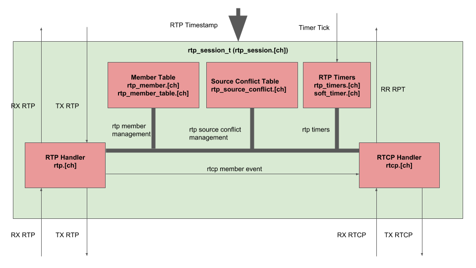

# prtp
  A simple to use and portable RTP library conforming to RFC 3550.
  'p' in prtp stands for petra & portable.

## Philosophy
  * Should be simple to use.
  * Should be portable to embedded micro controllers.
  * No sockets. It's your job to implement socket related functions, not RTP's.
  * No threading assumed. Whatever mechanism you might use, that is none of RTP's business.
  * No media recoding/playback mechanism assumed. That's none of RTP's business. That is yours.
  * Just conform to RFC3550! No more than that!
  * No malloc in library itself! Everything is static configured and this makes it easier to port the code to micro controller's with no heap.
  * Single threading assumed. If you wanna go with multi-threading, you gotta protect your rtp_session_XXX calls as well as rtp session callbacks with your own lock.

## Usage
As a prtp user, all you have to care is rtp_session_t defined in rtp_session.[ch].  
To use that, you have to implement  

  * a set of user callbacks for RTP RX/RTCP RR RX notification.
  * a user callback that returns current RTP timestamp, which is managed by you‥
  * a set of transport layer calls to send RTP/RTCP packets.
  * 100ms (by default) based timing service to manage internal RTP timers.

Just take a look at demo/. It is basically just a single-threaded/select() based implementation for a simple PCM uLaw playback.

## Architecture

## Demo
  * modify demo/rtp_task.c so that IP addresses conform to you. (Sorry this is just a demo)
  * replace test_pcm_ulaw.raw if you want something else
  * make
  * on the top level, build/petra_rtp_test 0 or build/petra_rtp_test 1 depending on your IP address setup
  * modify test_vlc.sdp depending on your IP address.
  * cvlc -vvv ./test_vlc.sdp
  * Enjoy your playback

## Unit Testing
Unit testing is done using CUnit.
  * sudo apt install libcunit1-dev if you don't have it installed on your machine
  * make unit_test
