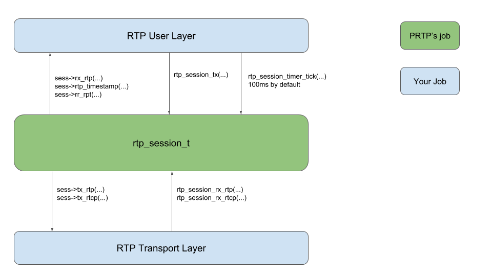

# prtp
  A simple to use and portable RTP library conforming to RFC 3550.
  'p' in prtp stands for petra & portable.

## Philosophy
  * Should be simple to use.
  * Should be portable to embedded micro controllers.
  * No sockets. It's your job to implement socket related functions, not RTP's.
  * No threading assumed. Whatever mechanism you might use, that is none of RTP's business.
  * No media recoding/playback mechanism assumed. That's none of RTP's business. That is yours.
  * Just conform to RFC3550! No more than that!

## Usage
As a prtp user, all you have to care is rtp_session_t defined in rtp_session.[ch].  
To use that, you have to implement  

  * a set of user callbacks for RTP RX/RTCP RR RX notification.
  * a user callback that returns current RTP timestamp, which is managed by you‥
  * a set of transport layer calls to send RTP/RTCP packets.
  * 100ms (by default) based timing service to manage internal RTP timers.

Just take a look at demo/. It is basically just a single-threaded/select() based implementation for a simple PCM uLaw playback.

## Architecture
FIXME

## Demo
FIXME
